---
## Front matter
lang: ru-RU
title: Лабораторная работа № 1
subtitle: Julia. Установка и настройка. Основные принципы.
author:
  - Шияпова Д.И.
institute:
  - Российский университет дружбы народов, Москва, Россия
date: 13 сентября 2025

## i18n babel
babel-lang: russian
babel-otherlangs: english

## Formatting pdf
toc: false
toc-title: Содержание
slide_level: 2
aspectratio: 169
section-titles: true
theme: metropolis
header-includes:
 - \metroset{progressbar=frametitle,sectionpage=progressbar,numbering=fraction}
---

## Докладчик

:::::::::::::: {.columns align=center}
::: {.column width="70%"}

  * Шияпова Дарина Илдаровна
  * Студентка
  * Российский университет дружбы народов
  * [1132226458@pfur.ru](mailto:1132226458@pfur.ru)

:::
::: {.column width="30%"}

:::
::::::::::::::

## Цель работы

Основная цель работы — подготовить рабочее пространство и инструментарий для
работы с языком программирования Julia, на простейших примерах познакомиться
с основами синтаксиса Julia.

## Теоретическое введение

Julia -- высокоуровневый свободный язык программирования с динамической типизацией, созданный для математических вычислений. Эффективен также и для написания программ общего назначения. Синтаксис языка схож с синтаксисом других математических языков, однако имеет некоторые существенные отличия.

Для выполнения заданий была использована официальная документация Julia 

## Выполнение лабораторной работы

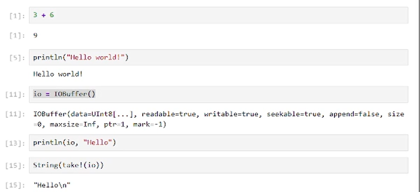{#fig:002 width=70%}

## Выполнение лабораторной работы

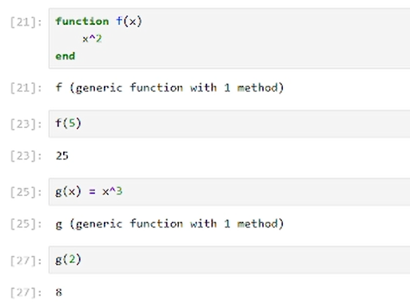{#fig:003 width=70%}

## Выполнение лабораторной работы

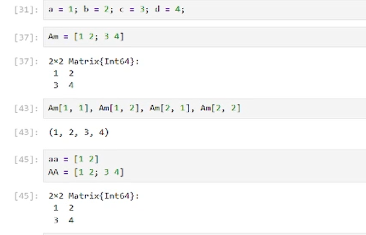{#fig:004 width=70%}

## Задание №1

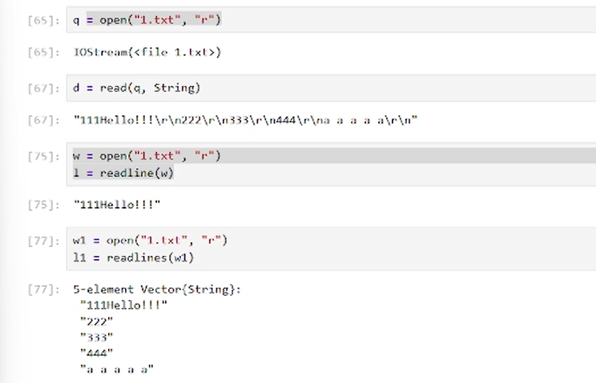{#fig:005 width=70%}

## Задание №1

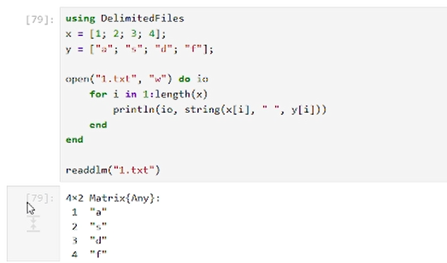{#fig:006 width=70%}

## Задание №1

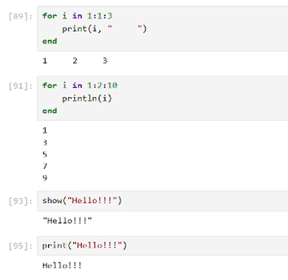{#fig:007 width=70%}

## Задание №1
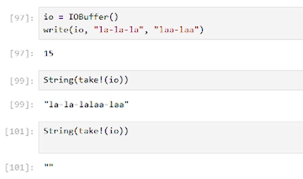{#fig:008 width=70%}

## Задание №2

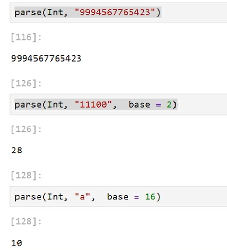{#fig:010 width=70%}

## Задание №3

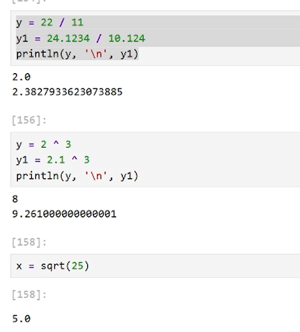{#fig:011 width=70%}

## Задание №3

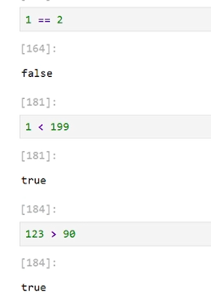{#fig:012 width=70%}

## Задание №4

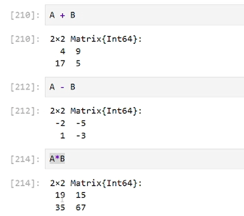{#fig:013 width=70%}

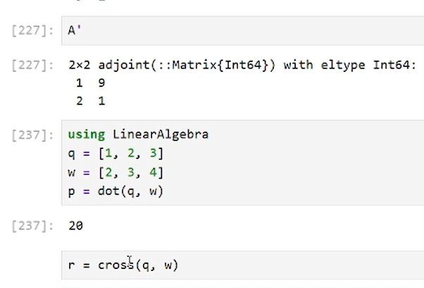{#fig:014 width=70%}

## Выводы

В результате выполнения данной лабораторной работы я подготовила рабочее пространство и инструментарий для
работы с языком программирования Julia, на простейших примерах познакомилась
с основами синтаксиса Julia.

